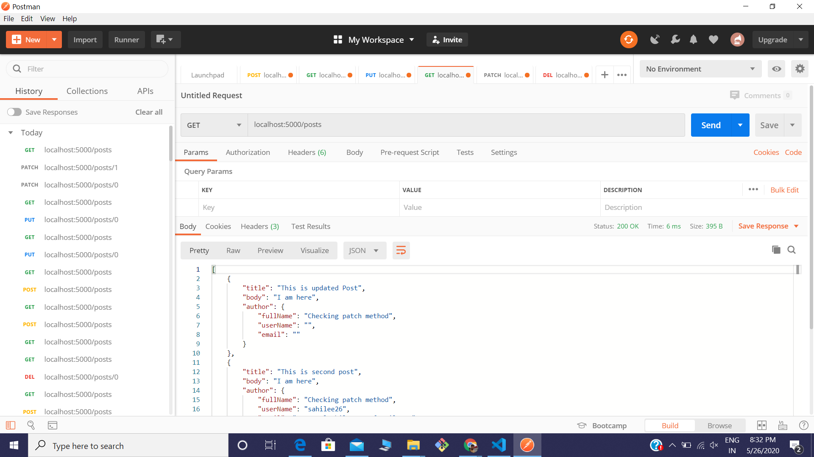

# RESTful http api in Golang

Learning folder contains various code snippets that I coded during learning to build api along with some screenshots

## Dependencies
web toolkit mux package

### About
Implemented all CRUD(create, read, update and delete) operations along with PATCH 

